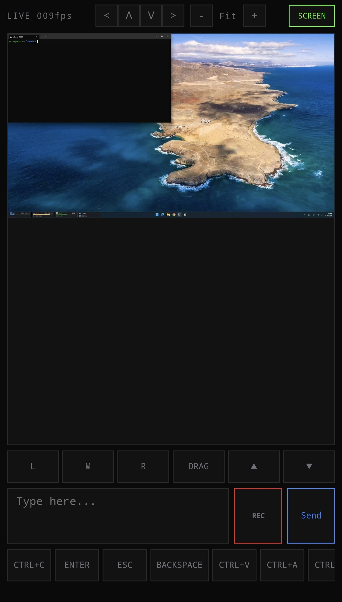
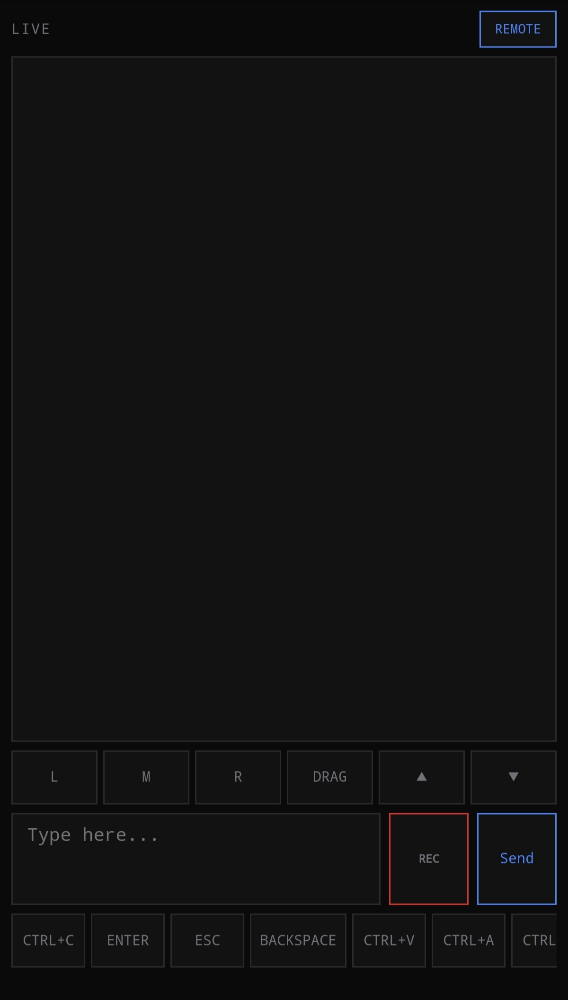

# DeskBeam / 桌面光束

Browser-based Windows desktop streaming and remote control. | 基于浏览器的 Windows 桌面串流与远程遥控。

Two deployment modes | 两种部署模式：
- **Full | 完整版**: desktop streaming (H.264) + remote control (mouse/keyboard/text/voice) | 桌面串流 + 远程控制
- **Remote-only | 纯遥控**: mouse/keyboard/text/voice — no GPU or screen capture deps | 仅鼠标/键盘/文字/语音，无需 GPU

Hardware H.264 encoding via NVENC/QSV/AMF. Touchpad, mouse, keyboard, text input, voice-to-text. Deploy as Python source or compile to a single portable exe. | 硬件 H.264 编码（NVENC/QSV/AMF），触控板/鼠标/键盘/文字输入/语音转文字。支持 Python 源码运行或编译为单文件 exe。

<p align="center">
  
  
</p>

---

## 1. Requirements / 环境要求

| Requirement | Full | Remote-only |
|-------------|------|-------------|
| Windows 10+ | Yes | Yes |
| Python 3.10+ | Yes | Yes |
| GPU (NVENC/AMF/QSV) | Recommended | No |
| Chromium browser 94+ | Yes | Recommended |
| WSL (voice REC) | Optional | Optional |
| openssl (TLS cert) | Yes | Yes |

---

## 2. Setup — Full mode / 完整版安装

```powershell
python -m venv .venv
.venv\Scripts\pip install -r requirements.txt

# Generate TLS certificate / 生成 TLS 证书
openssl req -x509 -newkey rsa:2048 -keyout key.pem -out cert.pem -days 3650 -nodes -subj "/CN=localhost"

copy config.example.json config.json
.venv\Scripts\python server.py
```

> **Firewall / 防火墙**: Windows may block inbound connections. Run the following to allow LAN access / Windows 可能阻止入站连接，请执行以下命令放行局域网访问：
> ```powershell
> New-NetFirewallRule -Name "DeskBeam" -DisplayName "DeskBeam" -Enabled True -Direction Inbound -Protocol TCP -Action Allow -LocalPort 8769
> ```

Open `https://<lan-ip>:8769` in Chrome/Edge. Accept the certificate warning. | 浏览器打开上述地址，接受证书警告。

> **No-SSL mode / 无证书模式**: If `cert.pem` and `key.pem` are missing, DeskBeam falls back to plain HTTP (no microphone in browser). Generate certs as shown above or skip for LAN-only use. | 缺少证书文件时自动降级为明文 HTTP（浏览器无法使用麦克风），按上方命令生成证书或局域网内直接使用。

---

## 3. Setup — Remote-only / 纯遥控安装

### Option A: Python

~2 MB install | 约 2 MB 安装：

```powershell
python -m venv .venv
.venv\Scripts\pip install -r requirements-remote.txt
openssl req -x509 -newkey rsa:2048 -keyout key.pem -out cert.pem -days 3650 -nodes -subj "/CN=localhost"
copy config.example.json config.json
.venv\Scripts\python server.py
```

### Option B: Standalone exe / 单文件可执行程序

Compile into a single `DeskBeamRemote.exe` — no Python installation needed on the target machine. | 编译为单文件，目标机器无需安装 Python。

```powershell
build_remote.bat
```

Deploy with these files / 部署只需这 4 个文件：

```
├── DeskBeamRemote.exe    # double-click to start / 双击启动
├── config.json            # edit before deploying / 部署前修改
├── cert.pem               # generate with openssl
└── key.pem
```

Process runs hidden (no terminal). Stop via: | 后台运行无窗口，退出方式：
- `stop.bat` (double-click / 双击)
- Task Manager → end `DeskBeamRemote.exe` | 任务管理器结束进程
- Browser: click the status text (`LIVE`/`RETRY`/`CONNECTING`) → confirm to close the app | 浏览器中点击状态文字 → 确认后关闭程序

---

### Logout / 退出登录

Click the status text (`LIVE` / `RETRY` / `CONNECTING`) in the top-left corner, then confirm to log out. Session cookie is cleared immediately. | 点击左上角状态文字，确认后登出，Session cookie 立即清除。

---

## 4. Run as background service / 后台运行

```powershell
start.vbs      # hidden + UAC elevation / 隐藏窗口+提权
start.bat      # visible CMD for debugging / 调试用
stop.bat       # kill server / 停止服务
```

---

## 5. Configuration / 配置

```json
{
    "port": 8769,
    "ssl_cert": "cert.pem",
    "ssl_key": "key.pem",
    "web_dir": "web",
    "token": "",
    "max_fps": 3,
    "streaming": true,
    "gop": 1,
    "wsl_asr_script": "~/scripts/asr.py",
    "asr_health_url": "http://127.0.0.1:8082/healthz",
    "asr_cooldown": 10
}
```

| Key | Type | Default | Description / 说明 |
|-----|------|---------|---------------------|
| `port` | int | 8769 | HTTPS/WSS port |
| `token` | str | `""` | Auth token; empty = no auth / 空则无需认证 |
| `max_fps` | int | 3 | Frame rate (ignored in remote-only) / 帧率 |
| `streaming` | bool | true | Enable screen streaming / 启用桌面串流 |
| `gop` | int | 1 | Keyframe interval; 1 = all I-frames (LAN), 30+ = P-frames (cloud) / 关键帧间隔 |
| `wsl_asr_script` | str | `~/scripts/asr.py` | ASR script path in WSL / WSL 内 ASR 脚本路径 |
| `asr_health_url` | str | `http://127.0.0.1:8082/healthz` | ASR health check URL / ASR 健康检查地址 |

---

## 6. Browser compatibility / 浏览器兼容性

| Browser | Remote | Screen |
|---------|:------:|:------:|
| Chrome / Edge 94+ | Yes | Yes |
| Opera / Brave | Yes | Yes |
| Firefox | Yes | No |
| Safari | Yes | No |
| iOS browsers | Yes | No |

---

## 7. GOP tuning / GOP 调优

Bandwidth at 2560×1440, CQ=26, static desktop / 静态桌面带宽（2560×1440, CQ=26）：

| `gop` | Keyframe interval | Bandwidth | Use case / 场景 |
|-------|-------------------|-----------|-----------------|
| 1 | every frame | ~23 Mbps | LAN, zero latency |
| 30 | every 1s | ~5 Mbps | Cloud 30M server |
| 60 | every 2s | ~3 Mbps | Cloud 3M server |

P-frames drop to ~200 bytes on static content. | 静态内容 P 帧仅 ~200 字节。

---

## 8. Architecture / 架构

```
Browser / 浏览器                           Python server / 服务端
┌──────────────────────┐               ┌─────────────────────────┐
│ canvas + VideoDecoder│◄── WSS (H.264)│ mss → screen capture   │
│ touchpad / mouse     │──► WSS JSON   │ numpy → cursor overlay  │
│ keyboard shortcuts   │   (control)   │ PyAV → H.264 encode    │
│ text input / voice   │──► WSS (WAV)  │   NVENC/QSV/AMF/x264   │
└──────────────────────┘               │ keyboard / ctypes       │
                                       │ WSL → ASR (voice)      │
                                       └─────────────────────────┘
```

---

## 9. Security / 安全

| Layer | Mechanism |
|-------|-----------|
| Transport | TLS 1.2+ WSS encryption (or SSH tunnel for remote) |
| Auth | Token via cookie (HttpOnly + SameSite=Strict), brute force: 5 fails → 24h block |
| Session | 24h expiry stored server-side |
| Path traversal | `relative_to()` sandbox |
| Logging | `audit.log` records login/logout/WS events |
| Secrets | `config.json`, `cert.pem`, `key.pem`, `*.ps1`, `audit.log` git-ignored |

### Self-signed cert / 自签名证书

Encrypts traffic but browser can't verify identity. First visit shows a certificate warning — this is expected. | 加密流量但浏览器无法验证身份，首次访问会提示证书警告，属正常现象。

### ARP spoofing / ARP 欺骗风险

On LAN, an attacker can redirect traffic + present a fake cert → full MITM (desktop contents, keystrokes, voice captured). | 局域网内攻击者可重定向流量+伪造证书，实现中间人攻击。

**Mitigations / 防御措施：**

1. **TOFU** — compare cert fingerprint after generation: `openssl x509 -in cert.pem -noout -sha256 -fingerprint`
2. **CA-signed cert** — use Let's Encrypt with a real domain
3. **Static ARP** — `arp -s <gateway-ip> <gateway-mac>`
4. **Don't expose on untrusted networks** / 不在不受信任的网络暴露

---

## 10. Files / 文件结构

```
├── server.py              # Main server / 主服务
├── encoder.py             # H.264 encoder (PyAV)
├── requirements.txt       # Full mode deps / 完整版依赖
├── requirements-remote.txt
├── build_remote.bat       # PyInstaller build / 编译脚本
├── config.example.json
├── start.vbs / start.bat  # Launchers / 启动脚本
├── stop.bat               # Kill server / 停止脚本
├── icon.ico / icon.png    # App icon / 图标
├── .gitignore
├── LICENSE
└── web/
    ├── index.html         # Browser UI / 前端界面
    └── login.html         # Auth page / 登录页
```

## 11. Disclaimer / 免责声明

DeskBeam provides remote desktop access. Misconfiguration (weak token, untrusted network, leaked secrets) may lead to unauthorized access, data loss, or other damages. The authors assume no liability for any loss or damage arising from the use of this software. Use at your own risk. | 本软件提供远程桌面功能。配置不当（弱口令、不受信任的网络、密钥泄露）可能导致未授权访问、数据泄露或其他损失。作者不承担任何责任，请自行评估风险。

## 12. License / 许可证

MIT — see [LICENSE](LICENSE)
