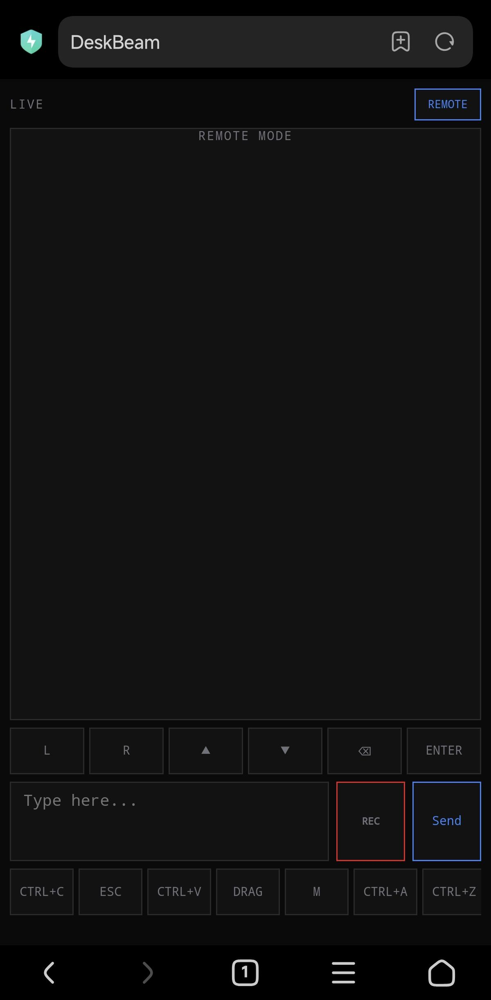
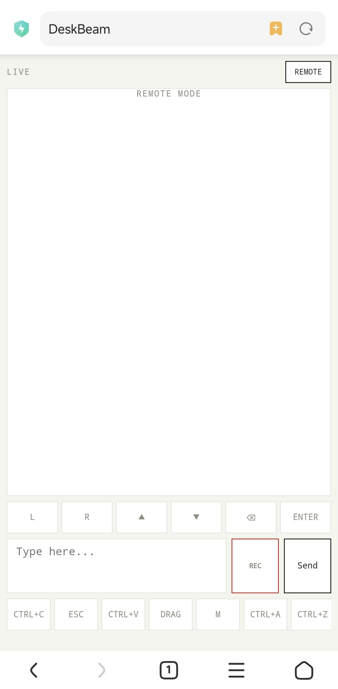
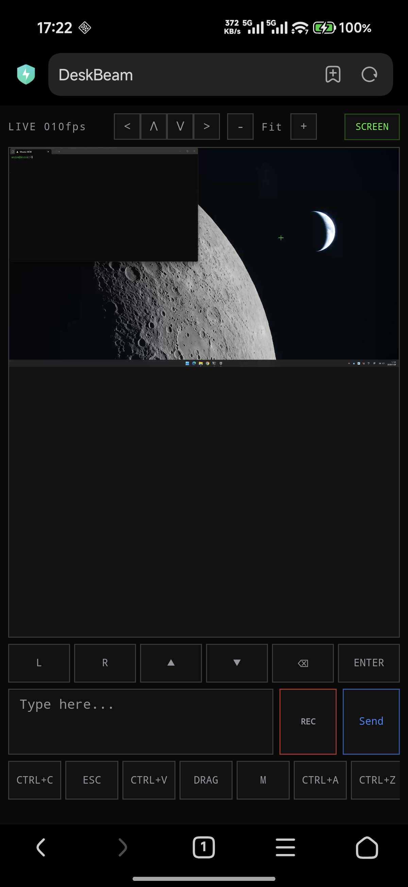
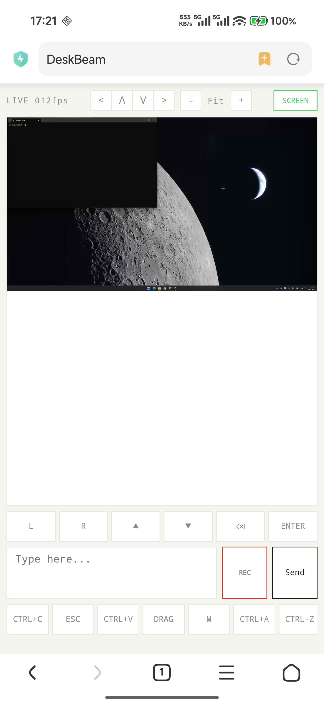

# DeskBeam

**基于浏览器的 Windows 桌面串流与远程遥控** —— 手机、平板、任意浏览器，随时随地控制你的 Windows 电脑。

<p align="center">
  
  
  <br>
  
  
</p>

---

## 功能特性

| 能力 | 说明 |
|------|------|
| 🖥️ **桌面串流** | **纯 GPU 串流**：ddagrab（DXGI）→ NVENC 全 GPU 管线，CPU 几乎零占用 |
| 🖱️ **触控板遥控** | 手机屏幕当触摸板，多指缩放、滑动、点击 |
| ⌨️ **快捷键** | 常用快捷键（Ctrl+C/V、Alt+Tab、F5、Win 等），支持多指同时按住 |
| 🎮 **GYRO 激光笔** | 手机陀螺仪当激光笔，晃动机身移动光标，PPT 演示神器 |
| 🎚️ **轴切换** | GYRO 页可手动切换横/竖屏轴映射，旋转设备自动复位 |
| 📊 **延迟监控** | 标题栏实时显示端到端累积延迟（帧序号测量），严重堆积自动重连释放 |
| 💬 **文字输入** | 浏览器输入框 → 电脑键盘输入 |
| 🎙️ **语音转文字** | 按住说话，自动识别为文字发送（在线 API 或本地 WSL） |
| 🖱️ **电脑端拖动** | 电脑浏览器按住左键拖动才移动远程光标，悬停不误移；原地单击才触发左键 |
| 🔐 **安全** | TLS 加密 + 口令认证 + 审计日志 |

**三种使用模式**（点击顶部模式按钮切换）：

- **REMOTE**：触控板遥控，无画面，纯控制（适合 SSH/后台任务）
- **SCREEN**：实时桌面串流 + 叠加控制，所见即所得
- **GYRO**：陀螺仪激光笔 + 快捷键 + 文字语音输入，PPT/演示场景

---

## 目录

1. [环境要求](#1-环境要求)
2. [快速开始](#2-快速开始)
3. [三种模式详解](#3-三种模式详解)
4. [部署模式](#4-部署模式)
5. [登录与操作面板](#5-登录与操作面板)
6. [后台运行](#6-后台运行)
7. [配置说明](#7-配置说明)
8. [语音识别](#8-语音识别)
9. [浏览器兼容性](#9-浏览器兼容性)
10. [性能调优](#10-性能调优)
11. [架构](#11-架构)
12. [安全](#12-安全)
13. [文件结构](#13-文件结构)
14. [常见问题](#14-常见问题)
15. [待办改进](#15-待办改进下次迭代)
16. [免责声明](#16-免责声明)
17. [许可证](#17-许可证)

---

## 1. 环境要求

| 条件 | 串流模式 | 纯遥控模式 |
|------|:---:|:---:|
| Windows 10+ | ✅ 需要 | ✅ 需要 |
| Python 3.10+ | ✅ 需要 | ✅ 需要 |
| GPU（NVENC/AMF/QSV） | ⭐ 推荐 | ❌ 不需要 |
| Chromium 浏览器 94+ | ✅ 需要 | ✅ 推荐 |
| WSL（本地语音识别） | 可选 | 可选 |
| openssl（TLS 证书） | 需要 | 需要 |

> **纯遥控**：即使没有 GPU/串流依赖，`server.py` 也能以"纯遥控"模式运行（鼠标/键盘/文字/语音），自动降级。

---

## 2. 快速开始

```powershell
git clone https://github.com/anzye2016/DeskBeam.git
cd DeskBeam

copy config.example.json config.json   # 首次需生成配置
start.bat                                # 自动装依赖 + 生成证书 + 启动
```

`start.bat` 自动完成：创建虚拟环境 → 安装依赖 → 生成自签名证书 → 启动服务。

**手动安装**等效步骤：

```powershell
python -m venv .venv
.venv\Scripts\pip install -r requirements.txt
python certgen.py                        # 自动选择 openssl 或 Python 生成证书
copy config.example.json config.json
.venv\Scripts\python server.py
```

**防火墙放行**（局域网访问）：

```powershell
New-NetFirewallRule -Name "DeskBeam" -DisplayName "DeskBeam" -Enabled True `
  -Direction Inbound -Protocol TCP -Action Allow -LocalPort 8769
```

然后手机/电脑浏览器打开：

```
https://<Windows主机局域网IP>:8769
```

首次访问浏览器会提示**证书警告**（自签名证书），点击"继续访问"即可。

> **无证书模式**：若 `cert.pem`/`key.pem` 不存在，自动降级为 HTTP（浏览器无法使用麦克风录音）。

### 免 Python 部署（exe）

目标机**不需要装 Python**。跑 `build.bat` 生成 `DeskBeam.exe`（PyInstaller onefile，前端 `web/` 已打进 exe），然后复制这些文件：

```
DeskBeam.exe            ← 已内置 web/ 前端，无需再拷 web/
config.json             ← 按 config.example.json 填好 token 等
cert.pem + key.pem      ← TLS 证书，两个文件缺一不可（或用 certgen.py 生成）
ffmpeg\ffmpeg.exe       ← GPU 串流用；不带则自动降级 CPU dxcam 软编
```

- **web 已打进 exe**，`web/`、源码 `.py`、`requirements.txt` 都不用拷
- ffmpeg 目录只需 `ffmpeg.exe`（ffplay/ffprobe 可省）；也可在 config.json 配 `ffmpeg_url` 让 exe 首次运行自动下载
- exe 为 `--uac-admin`，首次运行会弹 **UAC 提权**（UAC 快捷键、键盘注入需要管理员权限）
- 运行 `DeskBeam.exe` 即启动（守护/开机自启可配合计划任务）

---

## 3. 三种模式详解

### REMOTE — 触控板遥控

默认模式，无画面，纯控制。适合不需要看画面的场景。

- **触摸板**：手指滑动移动鼠标，双指缩放画面（SCREEN 模式下）
- **鼠标按钮**：L（左键）、R（右键）、滚轮、退格、Enter
- **快捷键栏**：Ctrl+C/V、Alt+Tab、Win、F5 等，支持**多指同时按住**（方向键+L+R 同时操作）
- **文字输入**：底部输入框 → Send 发送到电脑
- **语音**：按住 REC 说话 → 自动转文字发送

### SCREEN — 桌面串流

实时画面 + 叠加遥控。

- 硬件 H.264 编码串流（纯 GPU：ddagrab → NVENC），浏览器 VideoDecoder 解码
- 缩放档位：Fit / 1.5x / 2x / 3x / Full（Full 隐藏界面控件，纯画面）
- 标题栏显示 `LIVE <fps>fps <ms>ms`：fps 为解码帧率，ms 为**端到端累积延迟**（服务端每帧带帧序号，客户端用本地时钟计算，稳定时≈0，吞吐不足时增长）
- **延迟自动释放**：累积延迟持续超 1.5s 时自动重连视频流（控制通道不断），60s 冷却防抖
- 触摸板 + 快捷键 + 文字语音输入（同 REMOTE）

> **电脑端鼠标语义**（对齐手机触摸）：
> - **按住左键拖动** → 移动远程光标（悬停移动不移动远程，避免移向按钮时误移）
> - **原地按下松开**（位移 <5px）→ 左键点击（拖动第一下不会误触发点击）
> - 移鼠标到 UI 按钮按按钮 → 远程光标不受影响

### GYRO — 陀螺仪激光笔

**手机当激光笔**，最适合作演示 / PPT / 远程操控。

- **陀螺仪控制**：横屏或竖屏握持手机，晃动机身 → 光标跟随移动（`mouse_move` 角速度控制）
- **激光笔按键**：
  - `← →`：PPT 上一页 / 下一页
  - `↑ ↓`：方向键
  - `F5`：开始放映，`Esc`：退出
  - `B` / `W`：PPT 黑屏 / 白屏
  - `空格`：暂停 / 播放，`PgUp` / `PgDn` / `Home`：翻页
  - `L` / `R`：鼠标左键 / 右键
- **校准**：点击"校准"让光标回到屏幕中心
- **灵敏度**：左右 / 上下两个滑条，实时调节
- **轴切换**：标题栏按钮（`L`/`P`）手动切换横/竖屏轴映射——横屏默认用 `gamma/beta`，竖屏用 `gamma/alpha`；点击按钮强制取反，**再次旋转设备会自动复位为跟随方向**
- **文字 / 语音输入**：同 REMOTE，演示时可打字备注或语音输入
- **GYRO 开关**：顶栏点击 GYRO OFF/ON 随时启停陀螺仪

> GYRO 模式沿用了 SCREEN 的界面布局（画布 + 输入框 + 按钮区），画布显示桌面画面（可选 VIDEO 开关）。

---

## 4. 部署模式

`server.py` 根据已安装的依赖自动选择运行模式：

| 已装依赖 | 模式 |
|---------|------|
| `ffmpeg/`（自带，含 ddagrab + NVENC） | **纯 GPU 串流**（首选） |
| dxcam + av + numpy（无 ffmpeg） | **软件串流**（CPU，降级） |
| 缺少任一 | **纯遥控**（无画面，REMOTE/GYRO 仍可用） |

> **纯 GPU 模式与 Sunshine 同架构**：`ddagrab`（DXGI 桌面采集，GPU 内存）→ `h264_nvenc`/`h264_amf`（GPU 编码），中间无需任何 CPU 像素操作，CPU 占用趋近于 0。`ffmpeg/` 目录需自行放置配套的静态 ffmpeg 构建（见下文）。编码器按 **NVENC → AMF → QSV → libx264** 顺序自动探测，支持 NVIDIA / AMD / Intel 三种硬件；无硬编时回退 CPU 软编。

### 纯 GPU 串流（默认）

`ffmpeg/ffmpeg.exe` 存在即自动启用。它捆绑了 `ddagrab`、`h264_nvenc`、`scale_cuda` 等 GPU 滤镜，整条采集→编码管线在 GPU 上完成，Python 进程只读取编码后的 H.264 比特流，通过 WebSocket（TCP）转发给浏览器。

- 静态桌面也保持连续帧（`dup_frames=1`），浏览器帧率计数稳定
- 鼠标指针由 ddagrab `draw_mouse` 直接绘制进画面
- 启动时用一个不可见的 2×2 角窗触发一次桌面更新，保证首帧立即可达
- 若 ffmpeg 缺失或 GPU 驱动不支持 NVENC，自动回退到旧的 dxcam+PyAV 软件管线

> **驱动兼容（NVENC API 版本）**：NVENC 需要 NVIDIA 驱动支持 ffmpeg 构建所用的 NVENC API 版本。本项目配套的 ffmpeg 为 **n8.1.2 自定义静态构建**（gcc 15.2.0 交叉编译，构建日期 2026-06-30），按 **NVENC API 13.0** 编译，匹配驱动 **582.66**（GTX 10 系实测可用）。若启动日志出现 `Driver does not support the required nvenc API version (13.1 vs 13.0)`，说明换用了过新的 ffmpeg 构建（要求 API 13.1）而驱动仍只提供 13.0——**要么回退到本项目配套的 8.1.2 构建，要么更新 NVIDIA 驱动**。注意：过新的 master 构建可能要求更新驱动。

**获取配套 ffmpeg**（Windows x64，含 ddagrab + NVENC）：

- 本项目 `ffmpeg/ffmpeg.exe` 为自定义交叉编译的 **n8.1.2** 构建，需含 `ddagrab` demuxer + `h264_nvenc`（不是任意 ffmpeg 都能用，官方构建可能缺 `ddagrab`）。
- **自动下载（推荐）**：在 `config.json` 设 `"ffmpeg_url": "https://你的服务器/ffmpeg.exe"`，`DeskBeam.exe`/`server.py` 启动时若检测到 `ffmpeg\ffmpeg.exe` 缺失，会**自动下载并校验**（下载后执行 `ffmpeg -version` 验证）到 exe 旁。请托管**本项目的 8.1.2 构建**，不要指向最新版，否则目标机器同款驱动会再次遇到 NVENC API 不匹配。
- 手动：解压后将 `bin/` 下的文件放入本项目 `ffmpeg/` 目录。

---

## 5. 登录与操作面板

点击左上角状态文字（`LIVE` / `RETRY` / `CONNECTING`）弹出操作面板：

| 按钮 | 功能 |
|------|------|
| **Logout** | 退出登录，清除 cookie |
| **GYRO** | 进入 / 退出陀螺仪激光笔模式 |
| **Shutdown** | 关闭 DeskBeam 服务 |
| **LIGHT / DARK** | 切换主题 |
| **Cancel** | 关闭面板 |

认证逻辑：
- 登录页提交 token 时通过自定义请求头 `X-Auth-Token` 传输（token **不会**出现在 URL 中）
- 服务端 Cookie（HttpOnly + SameSite=Strict）会话，24 小时过期
- 口令错误 5 次后封锁 24 小时

---

## 6. 后台运行

| 脚本 | 用途 |
|------|------|
| `start.bat` | 调试启动（有 CMD 窗口，自动装依赖/证书） |
| `start.vbs` | 隐藏窗口 + 提权启动 |
| `stop.bat` | 停止服务 |
| `deskbeam-daemon.ps1` | **守护进程**（崩溃自动重启），可注册为计划任务开机自启 |

**守护进程**（推荐生产使用）：

```powershell
# 注册计划任务（开机自启 + 崩溃重启）
Register-ScheduledTask -TaskName "DeskBeam" `
  -Action (New-ScheduledTaskAction -Execute "powershell.exe" `
    -Argument "-NoProfile -WindowStyle Hidden -ExecutionPolicy Bypass -File $PWD\deskbeam-daemon.ps1") `
  -Trigger (New-ScheduledTaskTrigger -AtStartup) `
  -Settings (New-ScheduledTaskSettingsSet -RestartCount 3 -RestartInterval (New-TimeSpan -Minutes 1))

# 手动启停
Start-ScheduledTask -TaskName "DeskBeam"
Stop-ScheduledTask -TaskName "DeskBeam"
```

> 守护脚本会自动解析 Python 路径（优先 PATH，其次 `.venv`，最后常见安装位置），无需硬编码版本。

---

## 7. 配置说明

配置文件 `config.json`（首次从 `config.example.json` 复制）：

```json
{
  "port": 8769,
  "ssl_cert": "cert.pem",
  "ssl_key": "key.pem",
  "web_dir": "web",
  "token": "",
  "max_fps": 10,
  "max_fps_lan": 15,
  "gop": 10,
  "gop_lan": 15,
  "cq": 26,
  "cq_lan": 26,
  "preset": "p4",
  "preset_lan": "p4",
  "maxrate": "3M",
  "maxrate_lan": "20M",
  "bufsize": "6M",
  "bufsize_lan": "40M",
  "streaming": true,
  "ffmpeg_url": "",
  "wsl_asr_script": "~/scripts/asr.py",
  "asr_health_url": "http://127.0.0.1:8082/healthz",
  "asr_cooldown": 10,
  "asr_api_url": "",
  "asr_api_key": "",
  "asr_api_model": "mimo-v2.5-asr",
  "asr_api_auth": "",
  "asr_api_response_path": "choices.0.message.content"
}
```

| 键 | 类型 | 默认值 | 说明 |
|---|------|-------|------|
| `port` | int | 8769 | HTTPS/WSS 端口 |
| `ssl_cert` / `ssl_key` | str | cert.pem/key.pem | TLS 证书路径 |
| `web_dir` | str | web | 前端静态文件目录 |
| `token` | str | "" | 认证口令，空则跳过认证 |
| `totp_secret` | str | "" | TOTP 双因素密钥（base32），设置后登录需额外输入 6 位动态码 |
| `max_fps` | int | 10 | 广域网最大帧率 |
| `max_fps_lan` | int | 15 | 局域网最大帧率 |
| `gop` | int | 10 | 广域网关键帧间隔 |
| `gop_lan` | int | 15 | 局域网关键帧间隔 |
| `cq` | int | 26 | 广域网编码质量（越小越清晰，带宽越高） |
| `cq_lan` | int | 26 | 局域网编码质量（越小越清晰，带宽越高） |
| `preset` | str | p4 | 广域网编码预设（NVENC: p1-p7，越小画质越高；软件编码时 p4→veryfast） |
| `preset_lan` | str | p4 | 局域网编码预设 |
| `maxrate` | str | 3M | 广域网码率上限 |
| `maxrate_lan` | str | 20M | 局域网码率上限 |
| `bufsize` | str | 12M | 广域网 VBV 缓冲（≈2×maxrate：给 `cq`+`maxrate` 模式留足瞬时突发，压小会运动画质脉动变糊） |
| `bufsize_lan` | str | 80M | 局域网 VBV 缓冲（同上） |

> **画质关键**：`gop` 与 `fps` 的比值应保持 ~1（每秒一个关键帧）。比值过小（如 gop=1/fps=30）会导致编码器高频插入关键帧，画质劣化（色带/伪色）。GTX 1060 在 1440p 下 NVENC 编码上限约 14-15fps，目标帧率不要超过此值。
| `streaming` | bool | true | 是否启用桌面串流 |
| `wan_downscale` | bool | false | 广域网是否降分辨率。`false` 时广域网与局域网同样走原生分辨率（2K）；`true` 时采集原生桌面后缩放到 `soft_width/soft_height`（省带宽，CPU 少量占用） |
| `ffmpeg_url` | str | "" | 缺失 `ffmpeg\ffmpeg.exe` 时自动下载的 URL。指向本项目的 8.1.2 构建；空则不自动下载 |
| `asr_*` | — | — | 语音识别配置（见下文） |

---

## 8. 语音识别

录音 → server.py → 识别 → 文字发送到电脑。

**两种识别通道**：

```
录音 → server.py ──┬── asr_api_url 不为空 → 在线 API 直接识别
                   └── 本地 → WSL → asr.py → 本地模型服务 (:8082)
```

### 在线 API（推荐，零配置）

只需在 `config.json` 配置：

```json
{
  "asr_api_url": "https://your-asr-api.example.com/v1/chat/completions",
  "asr_api_key": "your-key",
  "asr_api_model": "mimo-v2.5-asr",
  "asr_api_auth": "api-key",
  "asr_api_response_path": "choices.0.message.content"
}
```

### 本地 WSL

由外部脚本 `asr.py` 把 WAV 音频转发到本地 ASR 模型服务（默认 `127.0.0.1:8082`）。换模型只需改 `asr.py` 里的 `SERVER` 地址，项目代码无需改动。

| 键 | 默认值 | 说明 |
|---|-------|------|
| `wsl_asr_script` | `~/scripts/asr.py` | WSL 内 ASR 脚本路径 |
| `asr_health_url` | `http://127.0.0.1:8082/healthz` | ASR 服务健康检查 |
| `asr_cooldown` | `10` | 服务不可用时重试间隔（秒） |

---

## 9. 浏览器兼容性

串流画面依赖 WebCodecs 的 `VideoDecoder` API（Chrome / Edge 94+）。Firefox / Safari 不支持 `VideoDecoder`，**无法显示串流画面**（服务端保留的 WebRTC 兜底代码未在前端启用），但仍可正常使用 REMOTE / GYRO 遥控功能。

浏览器兼容性：

| 浏览器 | 遥控 | 串流 |
|--------|:---:|:---:|
| Chrome / Edge 94+ | ✅ | ✅ VideoDecoder（纯 GPU 管线） |
| Firefox | ✅ | ❌ 无画面（无 VideoDecoder，WebRTC 兜底未启用） |
| Safari / iOS | ✅ | ❌ 无画面（同上） |

> 串流请使用 Chrome / Edge。Firefox / Safari 只能遥控，无实时画面。

---

## 10. 性能调优

### 纯 GPU 串流

串流路径默认全 GPU（ddagrab 采集 → NVENC 编码），CPU 占用接近 0（实测 1440p@60 约 1% 单核），GTX 1060 的 NVENC 在纯 GPU 管线下可稳定输出 30-60fps，不再受旧管线 CPU 搬运瓶颈（约 14-15fps）限制。

### GOP（关键帧间隔）

| `gop` | 含义 | 带宽（2560×1440, CQ=26） | 场景 |
|-------|------|------|------|
| 1 | 每帧 | ~23 Mbps | 局域网零延迟 |
| 15 | 每 0.5s | ~6 Mbps | 云服务器 15M |
| 30 | 每 1s | ~5 Mbps | 云服务器 30M |
| 60 | 每 2s | ~3 Mbps | 小带宽 3M |

静态内容 P 帧仅 ~200 字节。局域网可用 `gop_lan=15`、`max_fps_lan=30` 获得更流畅体验。

### 触摸性能

移动端已做全面手势优化：`touch-action:none` 全局禁用浏览器手势（防止滑动误触发返回导航），快捷键栏横向滚动由 JS 手动实现，灵敏度滑条原生拖动。

---

## 11. 架构

```
浏览器                                      Python 服务端
┌──────────────────────┐               ┌─────────────────────────┐
│ canvas + VideoDecoder │◄── WSS (H.264)│ ffmpeg ddagrab → NVENC  │ 纯 GPU 管线
│ 触控板 / 鼠标        │──► WSS JSON   │   (DXGI 采集→GPU 编码) │
│ 快捷键 / GYRO 陀螺仪 │   (控制)      │ sendinput (ctypes)      │
│ 文字输入 / 语音      │──► WSS (WAV)  │ WSL → ASR（语音识别）   │
│ GYRO 激光笔按钮     │               └─────────────────────────┘
└──────────────────────┘
```

- **串流**（默认）：`ddagrab`（DXGI 桌面采集，帧留在 GPU）→ `h264_nvenc`（GPU 编码）。CPU 只读取编码比特流，几乎零占用，与 Sunshine 同架构。
- **降级**：ffmpeg 缺失或 GPU 不可用时，回退到 `dxcam` 采集 + OpenCV 转换 + PyAV NVENC 的旧管线。

### 模块

| 文件 | 职责 |
|------|------|
| `server.py` | 主服务：HTTP/WSS、认证、串流、遥控命令、静态资源 |
| `capture.py` | 屏幕采集（dxcam，软件降级路径） |
| `speech.py` | 语音转文字（在线 API / WSL 本地，独立 executor） |
| `sendinput.py` | 输入注入（SendInput）：键盘/鼠标/文字，硬件扫描码兼容游戏 |
| `gpu_stream.py` | **纯 GPU 串流**：封装 ffmpeg ddagrab→NVENC 子进程，解析 H.264 访问单元 |
| `encoder.py` | H.264 编码器（PyAV，旧降级路径用） |
| `asr.py` | 语音转文字 CLI（WSL 本地模型转发） |
| `web/` | 前端：`index.html` + `style.css` + `app.js` |

---

## 12. 安全

| 层级 | 机制 |
|------|------|
| 传输 | TLS 1.2+ WSS 加密 |
| 认证 | Cookie 口令（HttpOnly + SameSite=Strict）+ 可选 TOTP 双因素，5 次失败封锁 24h |
| 会话 | 服务端 24 小时过期 |
| 登录限流 | 按真实客户端 IP 限流（经 SSH 隧道时读取 nginx 的 `X-Real-IP`；需 nginx 设置 `proxy_set_header X-Real-IP $remote_addr`） |
| 路径遍历 | `relative_to()` 沙箱防越权 |
| 审计 | `audit.log` 记录登录/登出/连接 |
| 密钥 | config.json / cert.pem / key.pem 已 gitignore |

### 自签名证书

加密流量但浏览器无法验证身份，首次访问会有证书警告——属正常现象。

### TOTP 双因素认证（可选）

口令之外再加一层 6 位动态码（RFC 6238），防撞库/口令泄露。开启方式：

1. 生成一个 base32 密钥（例如用任意在线工具，或 Python）：

   ```powershell
   python -c "import os,base64;print(base64.b32encode(os.urandom(20)).decode())"
   ```

2. 把密钥填进 `config.json` 的 `totp_secret`，重启 server：

   ```json
   "totp_secret": "JBSWY3DPEHPK3PXP"
   ```

3. 用 **Google Authenticator / Microsoft Authenticator / Authy** 扫密钥（手动输入或生成二维码 `otpauth://totp/DeskBeam?secret=<你的密钥>`）添加账号

之后登录流程：先输 Token，再输动态码（支持 ±1 个时间步容差）。`totp_secret` 留空则只验证口令（原行为）。

### ARP 欺骗风险

局域网攻击者可伪造证书实施中间人攻击。防御：
1. 生成证书后比对指纹：`openssl x509 -in cert.pem -noout -sha256 -fingerprint`
2. 使用真实域名 + Let's Encrypt 证书
3. 静态 ARP 绑定：`arp -s <网关IP> <网关MAC>`
4. 不在不受信任的网络暴露

---

## 13. 文件结构

```
DeskBeam/
├── server.py              # 主服务（串流 + 遥控；无串流依赖自动纯遥控）
├── capture.py             # 屏幕采集（dxcam，软件降级路径）
├── speech.py              # 语音转文字（在线 API / WSL，独立线程池）
├── sendinput.py           # 输入注入（SendInput：键盘/鼠标/文字/扫描码）
├── gpu_stream.py          # 纯 GPU 串流（ffmpeg ddagrab → NVENC）
├── encoder.py             # H.264 编码器（PyAV，旧降级路径）
├── asr.py                 # 语音转文字 CLI（WSL）
├── certgen.py             # 自签名证书生成（openssl / Python）
├── build.bat              # PyInstaller 打包为 DeskBeam.exe（免 Python 部署）
├── DeskBeam.exe           # 打包产物（gitignore，build.bat 生成）
├── requirements.txt       # 依赖清单
├── config.example.json    # 配置模板
├── start.bat / start.vbs  # 启动脚本
├── stop.bat               # 停止脚本
├── deskbeam-daemon.ps1    # 守护进程（崩溃自动重启）
├── ffmpeg/                # 纯 GPU 串流所需 ffmpeg（ddagrab + NVENC，见 .gitignore）
├── icon.ico / icon.png    # 图标
├── LICENSE                # MIT 许可证
├── docs/                  # 截图
└── web/
    ├── index.html         # 前端界面（REMOTE/SCREEN/GYRO 三模式）
    ├── style.css          # 前端样式
    ├── app.js             # 前端逻辑（触摸/按键/陀螺仪/语音/延迟监控）
    └── login.html         # 登录页
```

---

## 14. 常见问题

### 浏览器提示"不是私密连接"
自签名证书导致，点击"高级 → 继续访问"即可。

### 无法访问，提示拒绝连接
1. 确认服务已启动：`netstat -ano | findstr 8769`
2. 放行防火墙（见快速开始）
3. 确认访问的是主机局域网 IP，不是 localhost
### 没有画面（纯遥控模式）

缺少串流依赖（`ffmpeg/` 或 dxcam/av/numpy）或 `streaming=false`。启动日志会提示 `Streaming unavailable — running remote-only mode.`。纯 GPU 模式需放置 `ffmpeg/ffmpeg.exe`（含 ddagrab + NVENC），否则回退到 dxcam+PyAV 软件管线；两者都缺时安装 `pip install dxcam av numpy` 并重启。

### 陀螺仪不动 / 方向不对
1. 确认顶栏 GYRO 是 ON（点击切换）
2. 浏览器需允许陀螺仪权限
3. 不同手机轴定义略有差异，可调 `config.json` 或前端灵敏度/符号

### 快捷键栏滑动触发浏览器返回
已内置修复：全局 `touch-action:none` 禁用浏览器手势，快捷键栏横向滚动为 JS 手动实现。若仍异常请硬刷新（Ctrl+Shift+R）确保加载最新 app.js。

### 串流卡顿 / 帧率掉一半（如 55 → 30fps）
排查是否**其他串流/远程软件同时在跑**（Sunshine、ToDesk 等）。它们与 DeskBeam 共享 NVENC 编码器 + DXGI 桌面复制（DDA 同一输出只能有一个会话），会互相抢资源导致掉帧甚至 ffmpeg 退出。Sunshine 的 Windows 服务（`SunshineService`，开机自启）即使不串流也可能占用。确保同时只有一个串流软件运行。

### Firefox / Safari 无串流画面
Firefox / Safari 不支持 WebCodecs `VideoDecoder`，无法显示串流画面（WebRTC 兜底未启用）。请使用 Chrome / Edge 串流；Firefox / Safari 可正常使用 REMOTE / GYRO 遥控。

### 标题栏延迟（ms）一直增长到很大
说明网络吞吐不足，帧到达比服务端节奏慢，延迟在累积。持续超 1.5s 会自动重连视频流释放；若频繁触发说明长期带宽不足，可降低 `max_fps`/`cq`/`maxrate` 或换更大带宽。

---

## 15. 待办改进（下次迭代）

性能/延迟优化候选，按性价比排序。前一轮已完成并保留：解码背压跳帧（`decodeQueueSize` 深积压时跳 delta 等 key，不重连）、GPU 路径解除软编限速、`type_text` 批量 SendInput、audit 异步写盘、GPUStreamer 周期产帧/丢帧统计日志（`%TEMP%\gpu_stream_debug.txt`，区分采集侧掉帧与网络背压）、后台标签页治理（隐藏时不重连并暂停视频流）。

已实测并**回退**的教训（勿再尝试）：解码器 `optimizeForLatency:true`（GTX 1060 上强制低吞吐解码路径，1440p@55 掉到 ~30fps；编码侧已 `-bf 0`，本就不需要）；canvas `desynchronized:true`（部分驱动造成主线程停顿，fps 掉半）；GPUStreamer 帧队列 8（鼠标移动码率突发即溢出，丢 P 帧断参考链 → GOP 级冻结，16 是实测安全值）；**VBV bufsize 压到 1×maxrate**（`bufsize_lan` 100M→50M 后运动画面脉动式变糊——`cq`+`maxrate` 模式下鼠标移动的瞬时码率需要 2 秒突发余量，100M 是本机实测正确值，见 commit a044e1d）。注意 config.json 不入 git，配置级回退要手动核对。

| 项 | 位置 | 收益 / 说明 |
|---|------|------------|
| NVENC intra-refresh | `gpu_stream.py` 编码参数 | 关键帧尖峰摊平为周期性 intra 列：WAN（3M）下 IDR 引起的周期性排队抖动消失，画质更稳、平均码率略降。LAN 50M 收益小。**注意**：丢包恢复变慢（本架构走 WSS/TCP 无此问题）；需先验证配套 ffmpeg 构建支持 `-intra-refresh`。主要利好 WAN 低带宽场景 |
| 客户端渲染缓冲 `_rqMax` 6→4 | `web/app.js` | 渲染缓冲上限 ~110ms→~73ms；代价是抖动容忍变小，弱网手机端可能更频繁掉帧。建议实测 LAN/WAN 各跑一轮再定 |
| 多客户端共享一路 ffmpeg | 架构级 | 现在每个观察者各起一个 ffmpeg+DXGI+NVENC 会话；单编码多路分发可省 GPU 并绕过 DXGI 会话数限制。改动大，仅当确有多端同时观看需求再做 |
| legacy 采集降频条件 | `server.py` capture_worker | 鼠标静止时降到 20fps（GPU 主路径无此行为，`dup_frames=1` 全速）。legacy 下看视频时画面在变但鼠标不动会误降频；可将触发条件从"鼠标位置"换成 dxcam `grab() is None`（无新帧）更准 |

---

## 16. 免责声明

本软件按"原样"提供，不提供任何明示或暗示的担保。配置不当（弱口令、不受信任的网络、密钥泄露）可能导致未授权访问、数据泄露或其他损失。作者不承担任何责任，使用前请自行评估风险。

远程桌面软件涉及对被控计算机的完全访问权限。请仅在本机或您拥有合法授权的设备上使用本软件。使用本软件应遵守当地法律法规。详情见 [MIT 许可证](LICENSE)。

---

## 17. 许可证

MIT — 详见 [LICENSE](LICENSE)
